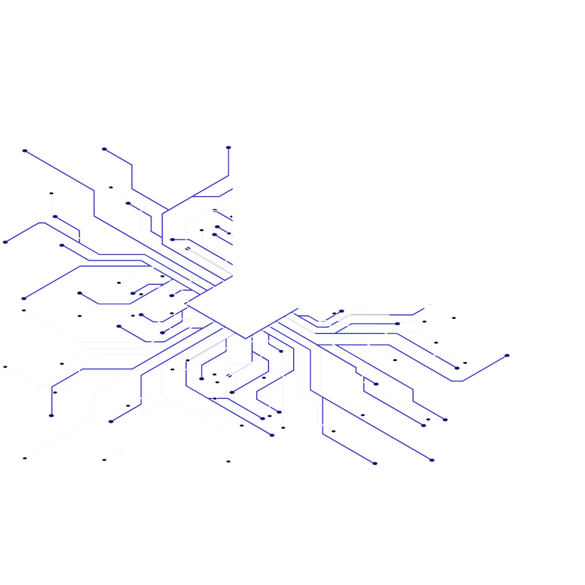

#### 👋 Hi, I’m @felttl
<pre>
“Everything should be made as simple as possible, but not simpler.” - Albert Einstein
“Less is more.” - Peter Behrens & Ludwig Mies van der Rohe
“Hard work beats talent when talent doesn’t work hard.“ – Tim Notke
“What makes you different or weird, that’s your strength.“ — Meryl Streep
“It does not matter how slowly you go as long as you do not stop.“ – Confucius
“People With Passion Can Change The World.“ - Steve Jobs 
</pre>

  

  

### Technology

 
  <!-- languages & others -->
  
  
  
  
  
  
  
  
  
  
  
  
  
  
  
  
  
  
  
  
  
  
  
  
  
  
  
  

<!-- apps & editors -->

 
  
  
  
  
  
  
  
  
  
  
  
  
  
  

<!-- OS -->

  
  
  
  
  

### soon 

  
  
  
  
  

### stats
<table>
<tr>
  <td valign="top" width="auto">
    
  
     
    

  </td>
  <td valign="top" width="auto">
    
  
    
    

  </td>
</tr>
<tr>
  <td valign="top" width="auto" colspan="2">
    
  
    
    

  </td>
</tr>
</table>

#### ❤️ my passion

- desktop dev
- mobile dev
- web dev
- game dev
- building systems
- security
- quantum
- know most recent news about general computer science

#### 📫 How to reach me :
######  for reply or any questions, it's still available anytime (github official) 
&nbsp;     

[tech details](https://github.com/felttl/root/blob/main/README.md)

  

<!-- appIdeas = test repo -->
